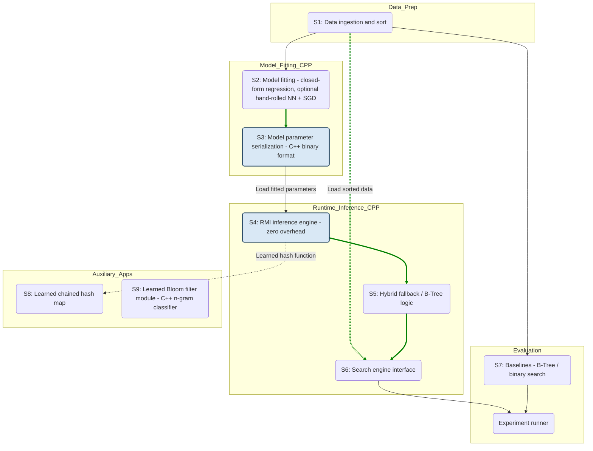

# Learned Index Structures — Project Plan

CS631 course project. Implementation of Kraska, Beutel, Chi, Dean and Polyzotis,
_The Case for Learned Index Structures_, SIGMOD 2018.

Team of two. Roughly 12–18 hours per week each, over 8 weeks.
All code written from scratch in C++17. No Python, PyTorch, or other ML framework
appears anywhere in the pipeline — model fitting (closed-form regression, and any
hand-rolled neural net) and inference both live in the same C++ codebase. The paper
itself measured a framework-based model at ≈80,000 ns per prediction against a B-Tree's
300 ns (§2.3) and built an entire code-generation layer (LIF) specifically to get off of
Tensorflow at inference time. We take that finding as given rather than re-deriving it,
and start from where their code-generation layer ends up: hand-written, dependency-free
C++.

---

## 1. What the paper says

The paper's central observation is in §2.2. A range index takes a key and returns the
position of the corresponding record in a sorted array. That is exactly what a
cumulative distribution function does, scaled by the number of records:

    pos = F(key) · N

So an index _is_ a model of the data distribution. A B-Tree learns that distribution as
a regression tree; but any function approximator that fits the same CDF can serve the
same purpose, and may do so in far less space.

From this one idea the authors derive learned replacements for all three index families
used in a DBMS:

| §   | Index type | Traditional structure | Learned version              | Reported result                                    |
| --- | ---------- | --------------------- | ---------------------------- | -------------------------------------------------- |
| 3   | Range      | B-Tree                | Recursive Model Index (RMI)  | 1.5–3× faster, up to 2 orders of magnitude smaller |
| 4   | Point      | Hash map              | `h(K) = F(K)·M`              | up to 77% fewer conflicts                          |
| 5   | Existence  | Bloom filter          | classifier + overflow filter | 36% less memory at 1% FPR                          |

### The RMI (§3.2)

Predicting a position to within ±100 out of 100M records with a single model is hard.
Going from 100M down to ±10k is easy, and then from ±10k down to ±100 is also easy,
because the second model only has to fit a small slice of the data. The RMI exploits
this: stage 1 takes the key and picks one of K stage-2 models; that model predicts the
final position. There is no search between the stages — stage 1's output directly
indexes into the stage-2 array.

### Guaranteed correctness (§3.3, §3.4)

A model prediction alone is not an index, because it can be wrong. The paper's solution
is that each last-stage model records its worst over-prediction and worst
under-prediction _over the keys it owns_, computed at build time. A lookup then searches
only the window bounded by those two errors. This is what makes the structure exact
rather than approximate: recall is 100% by construction, not by luck.

### Hybrid fallback (§3.3)

Algorithm 1 in the paper replaces any last-stage model whose maximum error exceeds a
threshold with a B-Tree over that model's keys. This bounds worst-case performance: on
data that is genuinely hard to learn, the structure degrades into a B-Tree rather than
becoming slower than one.

---

## 2. Objective and scope

We want to reproduce the paper's core claims on our own hardware, with our own
implementation, and report honestly where our numbers differ from theirs.

**We will implement:**

- A read-optimised B-Tree baseline (§3.7.1), which every other result is measured against
- A two-stage RMI with per-model error bounds (§3.2, §3.4)
- Hybrid indexes with B-Tree fallback (§3.3)
- Three search strategies: model-biased binary, biased quaternary, exponential (§3.4)
- The hash-model index and its conflict-rate evaluation (§4)
- A learned Bloom filter with an overflow filter (§5.1)
- The alternative baselines from Figure 5: a 3-stage lookup table and a fixed-height
  B-Tree with interpolation search

**We will not implement, and will say so in the report:**

| Left out                  | Reason                                                                                                    |
| ------------------------- | --------------------------------------------------------------------------------------------------------- |
| Inserts, updates, deletes | The paper itself only handles read-only indexes; the discussion of writes is deferred to its Appendix D.2 |
| String keys (§3.5)        | Needs a separate tokenisation and model pipeline, and the paper's own speedups there are modest           |
| FAST                      | Third-party SIMD code; the paper reports it is not significantly faster anyway                            |
| GPU/TPU execution         | The paper's own experiments are CPU-only                                                                  |
| Multi-threading           | Out of scope; all measurements single-threaded                                                            |
| N = 200M                  | 100M already exhibits every effect we care about; 200M only costs RAM and wall-clock time                 |

**Neural networks are a stretch goal, not the main path.** The paper trains small ReLU
nets for stage 1, but its own Figure 5 configuration — the one labelled "learned index
without overhead" — uses multivariate linear regression with automatic feature
engineering instead. We will use that as our primary stage-1 model, since it is enough
to fit a non-linear CDF and it keeps any notion of a training framework off the critical
path entirely — there is no LIF-style export step to build because there is nothing to
export from. If we are ahead of schedule we will add a small neural network, but it will
be built the same way as everything else in this project: a hand-written forward pass
and a hand-written SGD training loop, both in C++, with no autodiff library and no
cross-language boundary. This is more implementation work than calling a framework, and
we scope it as a stretch precisely because of that — see section 7 for what gets cut
first if time runs short.

### Project map

The project has three dependency layers:

1. **Research concepts:** understand the CDF interpretation before implementing the RMI,
   search correction, hash index, or learned Bloom filter.
2. **Software components:** build one shared data and evaluation foundation. Model
   fitting, inference, and search all stay inside that same C++17 codebase — there is no
   cross-language export boundary to design, version, or debug.
3. **Experiments:** establish the integer range-index reproduction first; only then use
   its validated outputs to support the string and hash claims. The learned Bloom filter
   remains a parallel existence-index track.

The diagrams below are the working dependency contract for the team. An arrow means the
downstream item should not be treated as complete until the upstream item is stable.

### 2.1 Research conceptual dependency DAG

This is the conceptual spine of the paper. Red nodes and links mark the ideas that must
be understood before the implementation can be interpreted correctly.

```mermaid
graph TD
  R1(Problem: Generic indexes assume nothing about data distribution)
  R2(Insight: Indexes as models - key to position mapping)
  R3(Insight: Range indexes represent CDFs of key distribution)
  R4(Method: Recursive Model Index - RMI)
  R5(Algorithm: Hybrid indexes - B-Tree fallback mechanism)
  R6(Algorithm: Biased search strategies - model error correction)
  R7(Claim: O/sqrt N scalability of model error)
  R8(Method: Hash-model index using learned CDF)
  R9(App: Separate-chaining learned hash map)
  R10(Method: Learned Bloom filters as classification problem)

  R1 --> R2
  R2 --> R3
  R2 --> R10
  R3 --> R4
  R3 --> R7
  R3 --> R8
  R4 --> R5
  R4 --> R6
  R8 --> R9

  linkStyle 0,1,3,5 stroke-width:4px,fill:none,stroke:#163a5c;
  style R2 fill:#d9e8f5,stroke:#163a5c,stroke-width:2px;
  style R3 fill:#d9e8f5,stroke:#163a5c,stroke-width:2px;
  style R4 fill:#d9e8f5,stroke:#163a5c,stroke-width:2px;
  style R6 fill:#d9e8f5,stroke:#163a5c,stroke-width:2px;
```

### 2.2 Software component dependency DAG

Everything lives in one C++17 codebase, so the split below is by pipeline stage, not by
language. Model fitting still happens before inference, and we still serialize fitted
parameters to disk so the benchmark runner can reload a model without refitting it every
run — but that serialization is a plain C++ binary format we own end to end, not a
cross-language export. Green links show the critical path from data to a runnable index.



### 2.3 Experiment dependency DAG

`E1` is the reproducibility gate. It must produce a correct integer range-index result
before the secondary claims are allowed to consume its configuration or conclusions.

```mermaid
graph LR
  RAW_INT[Integer datasets: Weblogs / Maps substitutes]
  RAW_STR[Google Doc-IDs string dataset]
  RAW_URL[Phishing URL dataset]

  subgraph Prep
  RAW_INT --> DP_INT[Sort / preprocess]
  RAW_STR --> DP_STR[Preprocess / tokenize strings]
  RAW_URL --> DP_URL[Process URLs]
  end

  subgraph Core_Reproduction
  DP_INT --> E1_Config[E1: Range-index configuration]
  E1_Config --> E1_Run[E1: Train / infer / search runner]
  E1_Run --> T4[Result: Table 4 / Figure 4]
  E1_Run --> Table5[Result: Table 5 baselines]
  end

  subgraph Secondary_Claims
  T4 --> E3_Run[E3: String range-index runner]
  T4 --> E4_Run[E4: Hash conflict-rate experiment]
  DP_STR --> E3_Run
  E3_Run --> Fig6[Result: Figure 6 string speedup]
  E4_Run --> E5_Run[E5: Learned hash-map runtime]
  DP_INT --> E5_Run
  E5_Run --> Fig11[Result: Figure 11 latency / space]
  end

  subgraph Existence_Indexes
  DP_URL --> E6_Run[E6: Learned Bloom filter]
  E6_Run --> Fig10[Result: Figure 10 memory footprint]
  end

  linkStyle 4,5 stroke-width:4px,fill:none,stroke:#163a5c;
```

### Dependency gates

The diagrams imply four concrete gates in the schedule:

| Gate                | Required evidence                                                            | Unlocks                                            |
| ------------------- | ---------------------------------------------------------------------------- | -------------------------------------------------- |
| G1: foundation      | Shared sorted-data format, correctness oracle, timing harness, fixed seeds   | All implementation work                            |
| G2: exact RMI       | Every present key found, absent-key checks pass, error bounds verified       | Hybrid indexes, search strategies, hash experiment |
| G3: E1 reproduction | Integer range-index results regenerated from one command and exported to CSV | String and hash secondary claims                   |
| G4: full evaluation | All structures pass correctness and size accounting is reconciled            | Figures, report, conclusions                       |

---

## 3. Datasets

The paper uses two real datasets, Weblogs (200M web-server log timestamps) and Maps
(200M OpenStreetMap longitudes). Neither is publicly available — both are internal to
Google. We substitute datasets from the SOSD benchmark that have similar shape, and we
will state this substitution clearly in the report rather than implying we used the
originals.

| Name          | Definition                                                      | Purpose                                                                                                              |
| ------------- | --------------------------------------------------------------- | -------------------------------------------------------------------------------------------------------------------- |
| `dense`       | `0 .. N-1`                                                      | Sanity check. The CDF is perfectly linear, so any correct model must fit it exactly                                  |
| `lognormal`   | lognormal(μ=0, σ=2), scaled to integers up to 1e9, deduplicated | The paper's synthetic heavy-tail dataset (§3.7.1)                                                                    |
| `wiki_ts`     | SOSD Wikipedia edit timestamps                                  | Stand-in for Weblogs. Timestamps carry awkward periodic structure, which is what made Weblogs the paper's worst case |
| `osm_cellids` | SOSD OpenStreetMap cell IDs                                     | Stand-in for Maps                                                                                                    |

Sizes: N ∈ {10M, 100M}. Keys are 64-bit, payloads are 64-bit.

Generating 190M unique lognormal keys by drawing, sorting and deduplicating needs
roughly 1.8 GB of intermediate memory. We will use a presence bitset over the value
range instead, which is about 125 MB.

---

## 4. Measurement methodology

Everything below is fixed in week 1 and not changed afterwards, because changing it
mid-project invalidates earlier results.

- Both structures compiled into the same binary with the same flags.
- One lookup sample per (dataset, N) pair, shared by every index measured on it:
  1M keys drawn from the dataset with replacement, then shuffled so there is no
  sequential locality.
- 1000 warm-up lookups per measurement, discarded.
- Five repetitions; we report the median.
- Every timed iteration writes to a `volatile` sink so nothing is optimised away.
- Build and training time is never inside a timing loop; it is reported separately.
- Fixed RNG seeds throughout, so every dataset and workload is reproducible.
- Compiled with `-ffp-contract=off`. This matters — see week 2.

Because the lookups in the timing loop are independent, the CPU overlaps their cache
misses. These are therefore throughput numbers under memory-level parallelism, not
isolated single-lookup latencies. That is a legitimate thing to measure and it is
applied identically to every structure, but we will state it explicitly rather than
letting a reader assume otherwise.

We report, per configuration: index size in bytes, total lookup time in ns, model
execution time in ns (the RMI's two-stage prediction, or the B-Tree's root-to-leaf
descent), that time as a percentage of the total, and speedup and size ratio against a
B-Tree with page size 128 — the paper's reference point.

---

## 5. Setup and external dependencies

These need to be sorted before or during week 1. Two of them have lead time, so they
are listed separately from the weekly tasks.

| Item                                     | Needed by                | Notes                                                                                                                 |
| ---------------------------------------- | ------------------------ | --------------------------------------------------------------------------------------------------------------------- |
| C++17 toolchain (g++ 11+ or clang 14+)   | Week 1                   | Must support `-march=native` and `-ffp-contract=off`                                                                  |
| A machine with at least 16 GB RAM        | Week 2                   | 100M keys plus 64-bit payloads is ~1.6 GB, but training and verification need headroom                                |
| CPU with AVX2                            | Week 6                   | Only for the branch-free scan in the lookup-table baseline; check early so we know whether that item is even possible |
| SOSD datasets (`wiki_ts`, `osm_cellids`) | Week 1                   | Several GB of downloads. Start this in week 1, not week 2                                                             |
| **PhishTank or OpenPhish access**        | Week 5                   | **Register in week 1.** Access is not always instant, and a delay here stalls the whole Bloom filter workstream       |

There is deliberately no Python or ML-framework row in this table — nothing in the
project depends on one. The multivariate regression is fit with closed-form normal
equations directly in C++ (`long double` accumulators, as in week 2's RMI); we
cross-check it against a handful of hand-computed toy examples rather than against a
NumPy reference. The row that has actually bitten people before is PhishTank/OpenPhish
access. We apply for the feed in week 1 even though we do not use it until week 5.

---

## 6. Roadmap

The B-Tree, the RMI and the Bloom filter do not depend on each other. Only the hash
index (§4) genuinely needs a finished RMI. We therefore split into two workstreams after
week 1 and rejoin in week 7.

| Week | Workstream A (systems)                  | Workstream B (models)                   |
| ---- | --------------------------------------- | --------------------------------------- |
| 1    | Foundations — joint                     | Foundations — joint                     |
| 2    | B-Tree baseline                         | RMI core                                |
| 3    | Cross-review, then search strategies    | Cross-review, then stage-1 models       |
| 4    | Hybrid indexes                          | Model quality, lognormal fix            |
| 5    | Hash-model index                        | Bloom filter: classical baseline + data |
| 6    | Figure 5 alternative baselines          | Learned Bloom filter                    |
| 7    | Integration and full evaluation — joint |                                         |
| 8    | Report — joint                          |                                         |

Whoever does not write the RMI still needs to be able to derive its error bounds from
scratch. We will swap workstreams for a session in week 4 to make sure neither of us
only understands half the project.

### 6.1 Collaboration protocol

The plan already forces the two things that make a two-person split actually work:
shared joint weeks at the start (1), middle (3, briefly), and end (7–8), and a single
correctness oracle (section 8) that both workstreams must pass independently before
anything gets trusted. What is missing from the schedule itself is the mechanics of
staying in sync between those joint points, so we fix them here rather than improvising
mid-project:

- **One shared interface, owned jointly, frozen after week 1.** The exact contract a
  "trained model" exposes — `predict(key) -> position`, `min_err`, `max_err`,
  parameter count, and how it (de)serializes to the S3 binary format in section 2.2 — is
  the seam the two workstreams meet at every week they are split. Write it down in a
  single header (e.g. `include/model_interface.h`) in week 1, and treat any change to it
  after that as something both people agree to explicitly, not something either person
  changes unilaterally to unblock themselves — an unannounced signature change is the
  most likely way for one person's week to silently break the other's.
- **A running decisions log, not just the plan.** This document fixes the intent; a short
  `DECISIONS.md` (one line per entry: what changed, why, who) records the deviations —
  a page size that turned out not to be optimal, a cut made ahead of the week 5
  checkpoint, a dataset substitution. The point is that the other person should be able
  to read one file and know what's actually true right now, without re-reading code.
- **Two short syncs per week, not one long one.** A ~15 minute check-in near the start of
  the week to confirm both people are building against the same interface, and another
  near the end to confirm both people's numbers reproduce on the other's machine. The
  second one matters more than it sounds: "works on my machine" for a benchmark is a
  reproducibility bug, and it's cheaper to catch on day 5 than in week 7.
- **Review the other person's correctness-critical code, not just your own.** Section 8's
  oracle catches wrong answers; it does not catch wrong reasoning that happens to pass
  the tests you thought to write. The error-bound sign convention (week 2) and the
  monotonicity fix (week 4) are exactly the kind of thing that benefits from a second
  reader who didn't derive it themselves.
- **Agree on formatting and naming once, in week 1** (a `.clang-format` file is enough),
  so week-3 and week-7 code review is spent on substance rather than style.

If a third person ever joined mid-project, `DECISIONS.md` plus the frozen interface
header should be enough to onboard them without a verbal handoff — that's a reasonable
bar to hold this section to.

---

### Week 1 — Foundations (joint)

Nothing is learned this week. We are building the instrument that every later number is
measured with, and both of us need to own it because it is the interface the two
workstreams meet at.

**What this week solves.** We cannot compare an RMI against a B-Tree until we have a
way to measure both fairly and check that both are correct. This week produces that,
and fixes the interfaces the two workstreams will meet at in week 7.

**Prerequisites**

- C++17 toolchain installed and verified with `-march=native -ffp-contract=off`
- SOSD downloads started (they are large; begin on day one)
- PhishTank / OpenPhish access requested — not needed until week 5, but the delay is
  outside our control

**Tasks**

- Repository, build system, a `make` target that produces one benchmark binary
- Dataset generation for all four datasets; SOSD loader
- Timing harness implementing section 4 above
- Correctness oracle: every key found at its exact position, sampled absent keys
  correctly report not-found, run aborts on failure
- Plain binary search and `std::lower_bound` as trivial baselines
- CSV output with the column set listed in section 4

**Problems to solve**

- _Interface design._ Week 5 needs the RMI as a hash function and week 6 needs a model
  as a classifier. We have to decide now how a trained CDF model is exposed, so that
  neither workstream blocks the other and week 5 is not a rewrite.
- _Throughput or latency._ We have to pick one and justify it, since they are different
  numbers and the choice is not reversible without redoing everything.
- _Dataset substitution._ Confirm that `wiki_ts` and `osm_cellids` really do have the CDF
  characteristics we are claiming they have, rather than assuming it.
- _Memory budget._ Check that 100M keys plus payload fits comfortably before week 2,
  not during it.

---

### Week 2 — B-Tree baseline and RMI core (split)

#### Workstream A: the B-Tree

Every result in the paper is a ratio against a B-Tree with page size 128. If our
baseline is weak, our speedups are meaningless. We build it as though we were trying to
beat the RMI with it.

**What this week solves.** Establishes the reference point. Without a credible B-Tree,
no speedup number we report later means anything.

**Prerequisites**

- Week 1 harness, datasets and correctness oracle finished and agreed by both of us
- Branch-free binary search primitive available (shared with workstream B)

**Tasks**

- Read-only, 100% fill factor, built bottom-up over the sorted array
- Leaf level is the sorted array itself, no copy; the array is excluded from both
  structures' reported size
- One 64-byte-aligned dense key array per internal level
- Page sizes 32, 64, 128, 256, 512, across all datasets and both N
- Report lookup time, traversal-only time, size

**Problems to solve**

- _Child pointers._ With a fixed fanout and 100% fill, the child of slot j in node i is
  node `i·P + j` of the level below, so the layout is implicit and no pointers need to be
  stored or dereferenced. This makes the baseline both smaller and faster than a
  pointer-carrying layout — which is the conservative choice, since storing pointers
  would inflate the baseline's size and slow its descent, flattering our RMI.
- _Is page 128 actually optimal here?_ The paper picks it because it wins on their
  hardware. If a different page size wins on ours we report both reference points.
- _Model complexity budget._ §2.1 argues that a B-Tree page traversal costs about 50
  cycles and a modern CPU issues 8–16 SIMD operations per cycle, so a model has roughly
  400 arithmetic operations available to beat a precision gain of 1/100 per node. We
  redo this arithmetic for our own cache hierarchy, because it tells workstream B how
  expensive a stage-1 model they can afford.

#### Workstream B: the RMI

**What this week solves.** Builds the structure the whole project is about, and
establishes the property that makes it an index rather than an approximation: bounded
search windows that guarantee 100% recall.

**Prerequisites**

- Week 1 harness, datasets and correctness oracle finished
- The sign convention for error bounds derived on paper _before_ coding begins
- Branch-free binary search primitive (shared with workstream A)

**Tasks**

- Two-stage RMI, K ∈ {10k, 50k, 100k, 200k} stage-2 models (the paper's values)
- Closed-form least squares, single pass over the sorted data — no gradient descent
- Per-model minimum and maximum error, computed at build time
- Bounded search within the error window
- 100% recall verified at every configuration

**Problems to solve**

- _The sign convention on the error bounds._ If error is defined as `predicted − actual`,
  then `actual = predicted − error`, so the true position lies in
  `[pred − max_err, pred − min_err]`. It subtracts, and the two bounds swap roles.
  Getting this backwards produces false negatives only on models that are not exact,
  which means it passes on `dense` and fails silently on everything else. We derive it
  on paper before writing any code and fix the convention in one place.
- _Floating-point determinism._ GCC defaults to `-ffp-contract=fast`, which may contract
  `slope*key + intercept` into a fused multiply-add at one call site but not another.
  Training would then compute a slightly different prediction than lookup does, a stored
  error bound would be off by one, and a key would go missing. Hence `-ffp-contract=off`.
- _Precision._ Keys reach 2^63 and N reaches 10^8, where the uncentred normal equations
  lose too much precision. We use the centred form with `long double` accumulators.
- _Memory during training._ Stage 1 is monotone in the key and the input is sorted, so
  each stage-2 model owns a contiguous run of positions. We store run boundaries and
  partition in a single pass, rather than materialising a key vector per model — the
  latter does not fit at 100M.
- _Degenerate models._ An empty bucket can only be reached by a key that is absent from
  the dataset. A bucket with one key has zero variance in x, so the closed form
  degenerates to slope 0 and intercept equal to that key's position, which is exactly
  correct with no special case needed.

---

### Week 3 — Cross-review, integration, search strategies

Each of us spends the first two sessions attacking the structure the other one built,
before we trust any number either of us produced. Then we integrate and produce the
first real RMI-versus-B-Tree comparison table.

**What this week solves.** Produces the paper's headline comparison, and catches the
mistakes each of us made in isolation before they propagate into five more weeks of work.

**Prerequisites**

- Both week 2 structures pass the full correctness oracle independently
- Both report size in bytes using the same accounting convention

**Tasks**

- Cross-review both structures
- Integrate into one benchmark binary with a shared lookup sample
- First speedup and size-ratio table
- Workstream A: implement model-biased binary search (first midpoint is the predicted
  position), exponential search (needs no stored bounds), and biased quaternary search
  (initial probes at `pos − σ`, `pos`, `pos + σ`, so the hardware prefetches all three)
- Workstream B: begin stage-1 model work

**Problems to solve**

- _Size accounting._ It is easy for the two of us to have been counting different things.
  Reconcile now rather than in week 7.
- _Search primitive parity._ Both structures must use the same branch-free binary search
  internally, so that no measured difference comes from the search code rather than the
  index.

---

### Week 4 — Hybrid indexes and model quality (split)

#### Workstream A: hybrid indexes and range semantics

**What this week solves.** Two things the RMI cannot yet do: bound its own worst case,
and answer range queries correctly. Until `lower_bound` works for absent keys, we have a
point-lookup structure, not an index.

**Prerequisites**

- Working B-Tree from week 2 (it becomes the fallback structure)
- Working RMI from week 2, with per-model error bounds exposed
- Search strategies from week 3

**Tasks**

- Algorithm 1 from the paper: after stage-wise training, replace any last-stage model
  whose maximum absolute error exceeds a threshold with a B-Tree over its keys.
  Thresholds 128 and 64.
- Verify the worst-case guarantee: on deliberately hard data, models are replaced and
  performance converges on the B-Tree's rather than falling below it.
- Correct `lower_bound` and `upper_bound` semantics, not only exact-match lookup.

**Problems to solve**

- _Monotonicity._ The error bounds guarantee we find every key that exists. For a key
  that does not exist, a non-monotone model can return the wrong bound, which breaks
  range queries. §3.4 gives two fixes: force the model monotone, or detect that the
  found bound sits on the edge of the search window and widen incrementally. We
  implement the second.
- _Expecting a negative result._ The paper states that for integer datasets, hybrid
  models and non-binary search strategies did not provide significant benefit — the
  gains appear on string keys. If we reproduce that null result, it is a successful
  reproduction and we report it as one. We will not tune until it wins.

#### Workstream B: stage-1 model quality

**What this week solves.** A linear stage 1 does badly on lognormal data. This week
finds out how much of that is recoverable with a better first-stage model, which is the
one place in §3 where model choice actually changes the result.

**Prerequisites**

- Working RMI from week 2 with a pluggable stage-1 model
- Closed-form normal-equations solver from week 2, extended to multiple features

**Tasks**

- Multivariate linear regression over automatically generated features:
  key, log(key), key², √key — closed-form, same `long double`-accumulator approach as
  week 2, just with a small feature matrix instead of a single scalar
- Grid search over feature set and K
- Confirm or refute the paper's finding that a richer first stage helps and a linear
  second stage is sufficient
- Stretch: small ReLU network for stage 1 — hand-written forward pass and a hand-written
  SGD training loop, both in C++, no autodiff library. This is the first hand-rolled
  gradient-based training in the project, so budget real time for it, not "afternoon"
  time; it is the piece most likely to get cut per section 7.

**Problems to solve**

- _Why a linear stage 1 fails on lognormal._ The logarithm of a lognormal variable is
  normally distributed, so in log-space the CDF is a sigmoid. A straight line compresses
  the dense middle of that sigmoid, and the stage-2 models that land there inherit
  enormous key counts. Increasing K subdivides the ordinary buckets but barely improves
  the worst one. This is a structural property of the model class, not a bug, and it is
  why the paper wants something richer than a line at stage 1.
- _Keeping the grid search affordable._ Each configuration retrains K stage-2 models over
  100M keys. We sample for the search and only train the finalists at full size.

---

### Week 5 — Hash-model index and Bloom filter groundwork (split)

**This is the checkpoint week.** If either workstream is more than a week behind, we cut
here rather than discovering the problem in week 8. Cut order is in section 7.

#### Workstream A: the hash-model index (§4)

The cheapest deliverable in the project — it reuses the finished RMI directly.

**What this week solves.** Tests whether the CDF idea generalises past range indexes —
the paper's claim is that the same learned model makes a better hash function.

**Prerequisites**

- Trained RMI exposed through the model interface fixed in week 1
- Ideally the improved stage-1 models from week 4, though week 2's RMI is enough to start

**Tasks**

- Hash function `h(K) = F(K) · M`, with F the learned CDF and M the number of slots
- MurmurHash3-style baseline, M = N slots, as in the paper
- Conflict rate and slot-occupancy distribution across all datasets
- Wire both into a real separate-chaining hash map and measure end-to-end lookup

**Problems to solve**

- _When a learned hash is worthless._ On uniformly distributed keys a linear model learns
  the CDF almost perfectly, and the resulting hash function is then no better than any
  decent randomising hash. The benefit requires skew. Our dataset set has to be able to
  demonstrate both outcomes; a result that always wins is a result we do not understand.
- _Whether fewer conflicts means faster lookups._ The paper is explicit that this depends
  on payload size and conflict-resolution policy, and that for small keys and values a
  traditional hash with Cuckoo hashing will probably do fine. We measure end-to-end,
  including model execution cost, rather than reporting conflict counts alone.

#### Workstream B: Bloom filter groundwork

**What this week solves.** Builds the baseline and assembles the data, so that week 6 is
spent on the learned filter rather than on data cleaning.

**Prerequisites**

- PhishTank / OpenPhish access granted (requested back in week 1)
- A whitelist source for the negative set, plus a random-URL generator
- The C++ SGD-training scaffolding, if week 4's stretch goal produced any, kept around
  for reuse in week 6

**Tasks**

- Classical Bloom filter: m bits, k hash functions, sized for target FPRs of 1% and 0.1%
- Assemble the dataset

**Problems to solve**

- _Getting the data._ The paper uses Google's Transparency Report, 1.7M blacklisted
  phishing URLs. We use a public feed such as PhishTank or OpenPhish. The negative set is
  a research decision rather than a detail — the paper reports 60% savings against random
  URLs and 21% against whitelisted lookalikes. We build both and report both, since that
  spread is the covariate-shift result.

---

### Week 6 — Alternative baselines and the learned Bloom filter (split)

#### Workstream A: Figure 5 baselines

These are what separate a reproduction from a demonstration.

**What this week solves.** A B-Tree is not the only competitor. These baselines test
whether the RMI's advantage survives against structures that are also tuned for
read-only lookup.

**Prerequisites**

- Week 2 B-Tree, for the fixed-height variant
- Confirmed AVX2 support on the test machine
- Model size from week 4, so the fixed-height B-Tree can be sized to match it

**Tasks**

- Three-stage lookup table: take every 64th key, pad to a multiple of 64, repeat once
  more over the resulting array; binary search the top table, then a branch-free AVX scan
- Fixed-height B-Tree sized to approximately 1.5 MB, matching our model's size, with
  interpolation search
- Histogram: the paper dismisses this in prose, arguing that an accurate CDF needs so
  many buckets that searching the histogram becomes the problem, and that fixing that
  yields a B-Tree. We reproduce the argument rather than the code.

#### Workstream B: the learned Bloom filter (§5.1)

**What this week solves.** The third index family. Unlike the previous two this is a
classification problem, not a CDF-fitting one, and it is the only part of the project
where the learned structure needs a classical structure alongside it to stay correct.

The paper's classifier is a character-level GRU. A GRU means backpropagation through
time, and we are not using an autodiff library anywhere in this project — hand-rolling
BPTT in raw C++ in a single week, on top of everything else due this week, is a
realistic way to lose the week. So we deliberately downgrade the model class while
keeping the paper's actual idea intact: a model that separates keys from non-keys, with
an overflow Bloom filter covering its false negatives.

**Prerequisites**

- Classical Bloom filter and both negative sets from week 5
- A general SGD training loop in C++ — reuse week 4's stretch-goal infrastructure if it
  exists; otherwise this is where that loop gets written for the first time
- The τ derivation done on paper before the filter is built

**Tasks**

- Primary classifier: logistic regression over hashed character n-grams (bigrams and
  trigrams, hashed into a fixed-width feature vector), sigmoid output, log loss, trained
  by hand-written SGD in C++. This is a linear model over non-linear features, in the
  same spirit as the multivariate stage-1 model in week 4 — deliberately, so the two
  hand-rolled-training efforts in the project share infrastructure and lessons learned.
- Choose threshold τ on the validation set
- Build the overflow Bloom filter over the false negatives
- Memory-versus-FPR curve against the classical filter
- Stretch, only if week 4's NN infrastructure landed cleanly and there is time to spare:
  a small character-level feed-forward net (fixed-width input, no recurrence, so no
  BPTT) as a second classifier to compare against the n-gram model. A full GRU stays out
  of scope — flag it as future work in the report rather than attempting it.

**Problems to solve**

- _The threshold arithmetic._ Overall false positive rate is
  `FPR_O = FPR_τ + (1 − FPR_τ)·FPR_B`. The paper sets both terms to `p*/2` so that
  `FPR_O ≤ p*`. We derive why that is sufficient, and consider what an uneven split of
  the budget would buy.
- _Guaranteeing zero false negatives._ The overflow filter must contain every key the
  model scores below τ. Missing one makes the whole structure unsound, so we test over
  the entire key set rather than a sample.
- _Honest memory accounting._ The model's own parameters count towards the total. The
  paper's GRU is 0.0259 MB and is included in its 1.31 MB figure against a 2.04 MB
  classical filter. Our n-gram model's parameter count is a hash-table-width choice we
  make ourselves, so we report a size-versus-accuracy curve for it rather than a single
  number, and we state plainly in the report that our classifier is architecturally
  simpler than the paper's — the comparison is honest but not apples-to-apples.
- _Understanding the trade-off._ Tightening τ lowers FPR but raises FNR, and the overflow
  filter grows with FNR. The paper reports 55% FNR and a 36% saving at 1% FPR, but 76%
  FNR and only 15% saving at 0.1%. We check whether our simpler classifier shows the same
  shape of trade-off, even if the absolute numbers differ.

---

### Week 7 — Integration and full evaluation (joint)

This week is deliberately light on new work, so that it can absorb slippage from earlier
weeks. If we are on schedule, we get a complete evaluation sweep and a week of margin on
the report.

**What this week solves.** Turns two workstreams' worth of separate results into one
reproducible set of numbers that the report can be written from.

**Prerequisites**

- Every structure passes its correctness requirements from section 8
- Both workstreams merged into a single binary with one build configuration
- Size accounting reconciled

**Tasks**

- Full run: every structure, every dataset, N ∈ {10M, 100M}
- Regenerate every CSV from fixed seeds
- Reconcile size accounting across both workstreams one final time
- Produce all report figures directly from the CSVs

**Problems to solve**

- _Reproducibility._ Any number that cannot be regenerated by a single command does not
  go in the report. No figure is transcribed by hand.

---

### Week 8 — Report (joint)

**What this week solves.** Says what we found, including where we disagree with the
paper and where we ran out of time.

**Prerequisites**

- Complete result set from week 7, regenerable from fixed seeds
- All figures generated from CSVs, none transcribed by hand

**Tasks**

- Write up, structured as: reproduced / diverged / not attempted
- Document the scope limits from section 2 explicitly
- Explain each cut we made and why

**Problems to solve**

- _Writing divergences as findings._ Where our numbers disagree with the paper's, the
  explanation is the interesting part. Hardware differs, dataset substitutes differ, and
  our implementation is not theirs. A well-argued divergence is a better outcome than a
  number that happens to match.

---

## 7. Risks and contingency

The main risk is that weeks 2 and 4 overrun — the B-Tree layout and the range-query
semantics are both easy to underestimate. The week 7 buffer exists for this.

If we fall behind, we cut in this order, decided at the week 5 checkpoint:

1. Figure 5 alternative baselines
2. The neural network stretch goal in week 4
3. Hybrid indexes (§3.3) — cut last, because the worst-case guarantee is one of the
   paper's better ideas and it is cheap once both structures exist

We will not cut, under any circumstances: the quality of the B-Tree baseline, the
per-model error bounds, or the zero-false-negative verification. Those three are what
make the project a reproduction rather than a demonstration.

---

## 8. Correctness requirements

Checked before any timing run, on every structure, with the run aborting on failure:

- Every key in the dataset is found at its exact position — zero false negatives
- At least 1000 keys known to be absent all report not-found
- On `dense`, the RMI fit is exact and the search window is a single slot
- Mean error width decreases monotonically as K increases
- No single stage-2 model owns more than 50% of the keys
- For the Bloom filter, false negative rate measured over the entire key set is exactly zero
- For the hash index, conflict counts reconcile with the slot-occupancy histogram

---

## References

- T. Kraska, A. Beutel, E. H. Chi, J. Dean, N. Polyzotis. _The Case for Learned Index
  Structures._ SIGMOD 2018.
- R. Marcus et al. _SOSD: A Benchmark for Learned Indexes._ NeurIPS Workshop on ML for
  Systems, 2019. — source of the `wiki_ts` and `osm_cellids` datasets.
- C. Kim et al. _FAST: Fast Architecture Sensitive Tree Search on Modern CPUs and GPUs._
  SIGMOD 2010. — referenced as a baseline in the paper; not implemented here.